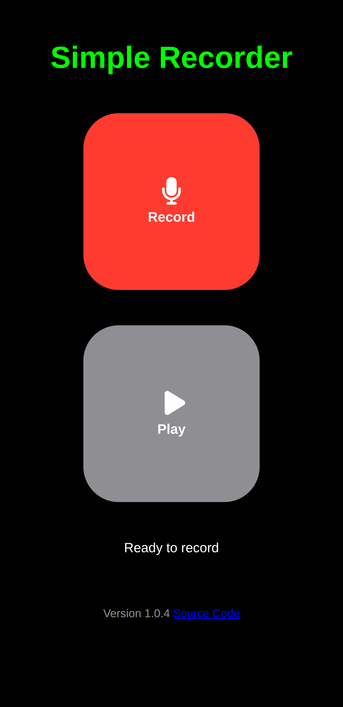

# SimpleRecorder
A minimalist web app for music practice and learning.



## Philosophy
Credible research shows that the single most powerful learning tool is *frequent low-stakes testing with immediate feedback*.  That's what SimpleRecorder is designed to do.

It's intentionally the simplest possible interface: Hit Record, then play or sing a short passage you're working on. 

Then hit Stop, hit Play and *listen*. Ask yourself "What, specifically, can I do to make that better?"

Then take another shot at it.  *Lather, rinse, repeat.*

## Anti-Philosophy
SimpleRecorder is not a DAW.  It doesn't even support saving your audio as a file.  There's no metronome, equalizer, tuner, waveform display, practice log, overdubbing, multi-tracking, FX, ... or anything except a distraction-free way to record and listen to short segments of your playing and singing.

DAW's are great for producing and sound engineering, but I find I get sidetracked playing with settings and features when what I really need to be doing is getting a piece into my voice and fingers so I can perform it live.

## Getting started
The latest stable version will always be available for immediate use from my GitHub Pages at [michael-f-ellis/github.com/SimpleRecorder](https://michael-f-ellis.github.io/simplerecorder/).

You'll need a modern web browser (Chrome, Firefox, Edge, Safari) and a computer, tablet or smartphone.

See below if you want to install it locally.

### Installation (Local Development)

1.  **Clone the repository:**
    ```bash
    git clone https://github.com/your-username/SimpleRecorder.git
    cd SimpleRecorder
    ```
2.  **Open `index.html`:**
    Simply open the `index.html` file in your web browser. No server-side setup is required.

## Usage

1.  **Grant Microphone Access:** The first time you use SimpleRecorder, your browser will ask for permission to access your microphone. Please grant this permission.
2.  **Start Recording:** Click the "Record" button to begin recording.
3.  **Stop Recording:** Click the "Record" button again to end the recording.
4.  **Play:** Use the "Play" button review your recording. You can stop playback by clicking it again.

## Hands-Free Operation
If you have a remote page turner pedal (e.g Donner DBM-1) that acts like a virtual keyboard, set it to send *Enter* to toggle Record and *Space* to toggle Play.


## Contributing

I'm not intending to add more features to the app. That would be contrary to my intent to keep it as simple and distraction-free as possible.  You're certainly welcome to create a fork and add whatever features you want.

Bug fixes and tweaks to UI appearance are always welcome.

## License

This project is licensed under the MIT License - see the [LICENSE](LICENSE) file for details.

## Contact

For any questions or feedback, please open an issue on GitHub.
