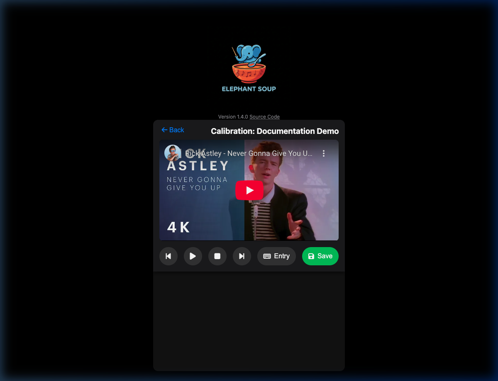
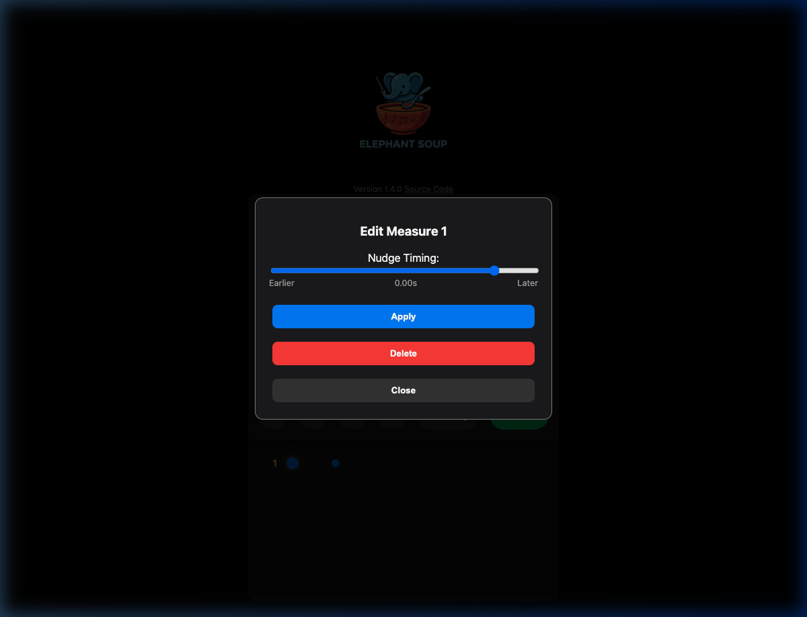
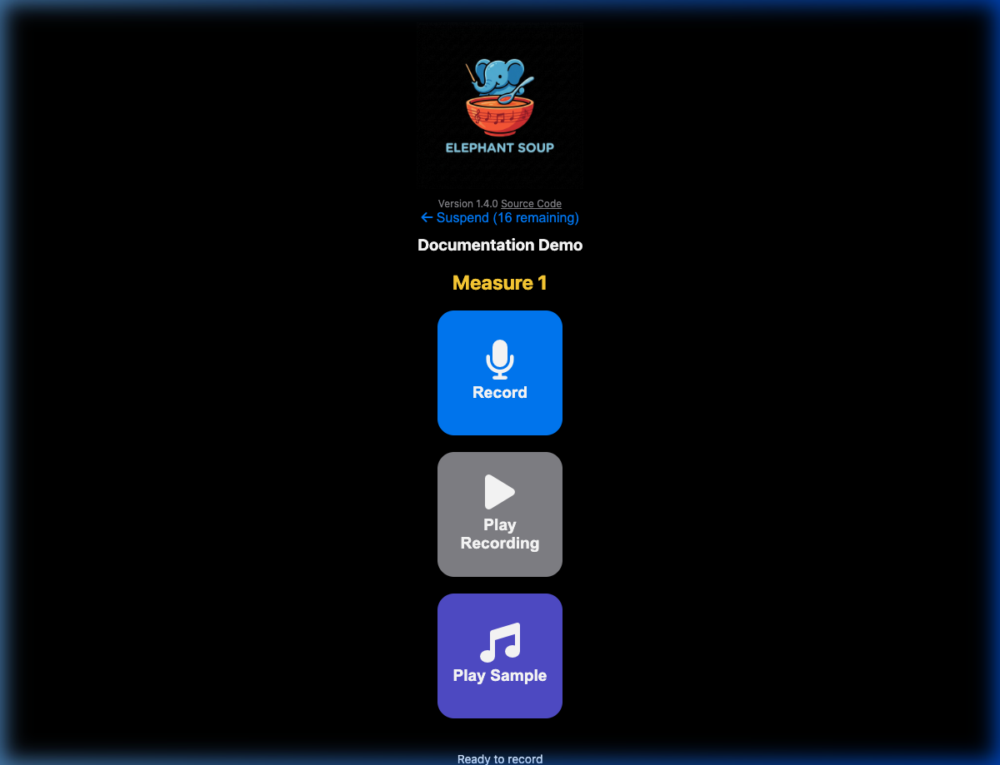

# Elephant Soup
### "How do you eat an elephant? One bite at a time."

Elephant Soup is a minimalist web app designed to help musicians master complex repertoire. By breaking a piece down into small, distinct segments (measures) and continually re-assembling them, it helps you build secure, performance-ready memory.

**[Try it Live](https://michael-f-ellis.github.io/elephantsoup/)**


## Philosophy
Credible research [^1] shows that the single most powerful learning tool is *frequent low-stakes testing with immediate feedback*. That's what Elephant Soup is designed to do.

By design, it incorporates other key insights[^2] from the research:

- Interleaved Practice
- Chunking
- Micro-breaks
- Spaced Repetition


[^1]: *Brown, Peter C. Make It Stick : the Science of Successful Learning. Cambridge, Massachusetts :The Belknap Press of Harvard University Press, 2014.*
[^2]: *Gebrian, Molly, Learn faster, Perform better: a musician's guide to the neuroscience of practicing. New York, NY: Oxford University Press, 2024.*

## How It Works

### Targeted Efficiency
Elephant Soup uses your assessments of difficulty to ensure that you spend the most time on the most difficult sections, preventing mindless run-throughs of parts you already know.

### Sequence Learning
Unlike flashcard apps (e.g. Anki, Mnemosyne, SuperMemo) that focus on independent items, Elephant Soup tackles **sequences**—be it a piece of music, a poem, or lines from a play. 
- It starts by presenting individual segments -- typically a single measure or phrase ­-- for you to perform. A built-in recorder helps you capture your performance and rate it based on your readiness.
- As you rate adjacent segments as "Ready", the app gradually groups them together.
- Over time, you build larger and larger chunks of the piece until the whole sequence is mastered.

### Maintenance Mode (Spaced Repetition)
Once a piece is fully merged into a single segment (Mastered), Elephant Soup switches to **Spaced Repetition** mode to help you maintain it efficiently.
Instead of random access, the piece is scheduled for review based on your rating:
- **Rate 0**: Review Today
- **Rate 1**: Review Tomorrow
- **Rate 2**: Review in `max(1 day, elapsed_time)`
- **Rate 3**: Review in `max(2 days, 2 * elapsed_time)`

Your rating and the elapsed time since you last practiced determine the review interval. The maximum interval is 1 year.

### The Workflow
1.  **Add a Piece**: Name your piece and define the number of measures (or segments). You can optionally provide a **YouTube Video ID** to enable synchronized practice.
2.  **Calibrate (Optional)**: If you provided a YouTube ID, click the cog icon to map measure numbers to specific time offsets in the recording. See [YouTube Integration](#youtube-integration) below.
3.  **Start Practice**: The app creates a shuffled queue of segments for the current session.
4.  **The Loop**:
    - **Play Sample**: Listen to the reference recording for the current segment (if calibrated).
    - **Record** your attempt at the presented segment.
    - **Listen** back critically.
    - **Rate** your readiness:
        - *Not Ready*: Needs more work.
        - *Copable*: Almost there.
        - *Ready*: Secure.
5.  **Progress**: Your ratings don't change the current session's queue, but they determine how segments are grouped and chosen for the *next* session.

## YouTube Integration

Elephant Soup allows you to sync your practice sessions with a YouTube recording. This provides a high-quality reference and ensures you're practicing at the correct tempo and with the right musical context.

### Calibration
Once you've added a YouTube Video ID to a piece, click the cog (<i class="fas fa-cog"></i>) icon in the repertoire list to enter **Calibration Mode**.



*   **Entry Mode**: Play the video and tap the screen (or hit Space/Enter) on each downbeat. Elephant Soup will record the timestamps for each measure.
*   **Visual Feedback**: A grid of dots represents your mapped measures. The dots are spaced proportionally to reflect the actual timing in the recording.
*   **Fine-Tuning**: Click a dot to seek to that point. Double-click any dot to open the **Nudge** menu, where you can micro-adjust the timing or delete a marker.



### Practice with Samples
During your practice session, if a segment has been calibrated, a **Play Sample** button will appear. 



Clicking this will play the corresponding section of the YouTube recording, including a **2-second pre-roll** to give you the necessary musical lead-in.

## Getting Started
The latest stable version is available at [michael-f-ellis.github.io/elephantsoup](https://michael-f-ellis.github.io/elephantsoup/).

You'll need a modern web browser (Chrome, Firefox, Edge, Safari) and a computer or mobile device with a microphone to use Elephant Soup.

## Installation (Local Development)
If you want to run Elephant Soup locally or contribute:

1.  **Clone the repository:**
    ```bash
    git clone https://github.com/Michael-F-Ellis/ElephantSoup.git
    cd ElephantSoup
    ```
2.  **Install dependencies:**
    ```bash
    npm install
    ```
    *Note: This installs Vite, TypeScript, and Playwright integration. If you plan to run automated tests, you also need to install the browser binaries:*
    ```bash
    npx playwright install
    ```

### Deployment Dependencies
If you plan to use the `deploy.py` script to deploy to GitHub Pages, you will need **Python 3** installed on your system.
You'll also need to copy the `deploy.sample.py` file to `deploy.py` and edit it to include your GitHub Pages URL.

3.  **Run the dev server:**
    ```bash
    npm run dev
    ```

## History
This app evolved from [SimpleRecorder](https://github.com/Michael-F-Ellis/SimpleRecorder), expanding the core recording philosophy into a structured practice tool.

## License
This project is licensed under the MIT License - see the [LICENSE](LICENSE) file for details.
